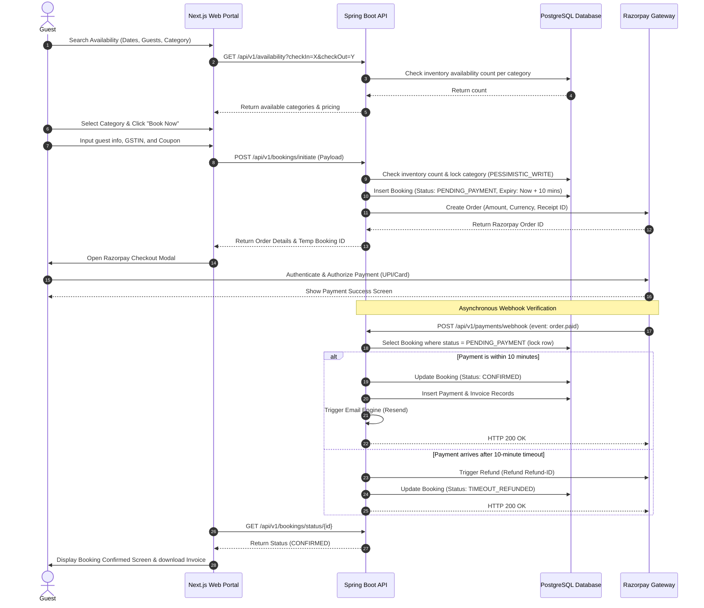
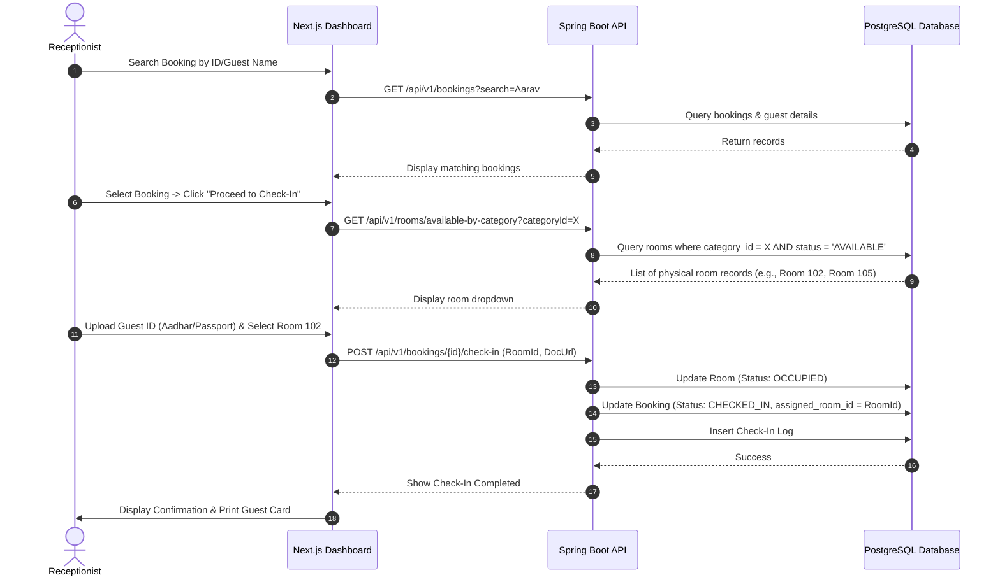
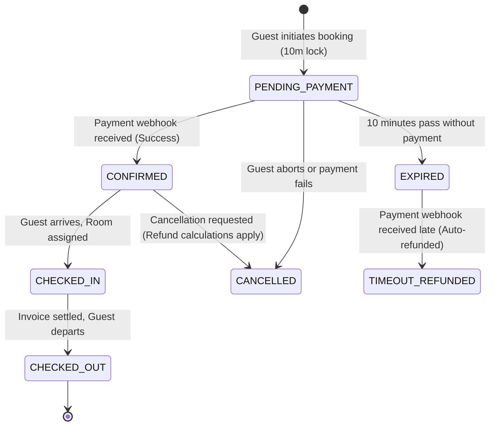
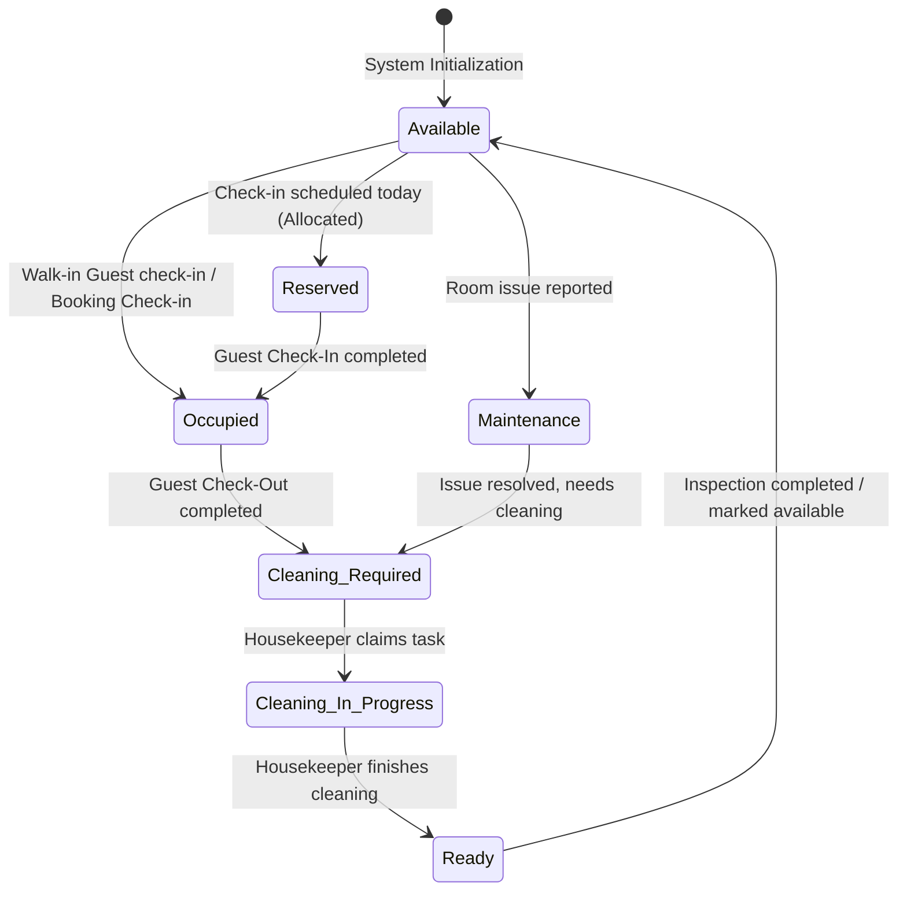

# User Journeys, Operational Workflows, & State Transitions

---

## 1. User Journeys & Target Personas

### 1.1 Persona A: Aarav Mehta (The Direct Guest)
- **Role:** Guest / Customer
- **Context:** Aarav wants to book a 3-night holiday at the resort in Goa for his wedding anniversary. He prefers a premium room (Suite Room).
- **Journey:**
  1. Lands on the resort website; is impressed by the parallax scroll animations and high-resolution galleries.
  2. Uses the **Search Availability Widget** on the homepage, inputs dates (Oct 12 to Oct 15) and selects "2 Adults".
  3. Views available room categories. Filters by premium amenities. He chooses the "Suite Room" category.
  4. Enters his contact details (Name, Email, Mobile, Billing Address in Mumbai, Maharashtra) and inputs his corporate GSTIN for tax claims.
  5. Applies a coupon code `ANNIVERSARY10` to get a 10% discount.
  6. Reviews the billing breakdown: Base price reduced by discount, GST calculated at 18% (since final tariff $\ge$ ₹7,500/night), and SGST/CGST split shown.
  7. Clicks "Pay Now", selecting UPI on the Razorpay interface. He scans the QR code and authorizes payment on his phone.
  8. Immediately receives a "Booking Confirmed" screen showing his Booking ID (`RES-20261012-045`), and a PDF invoice is sent to his email.

### 1.2 Persona B: Priya Sharma (The Receptionist)
- **Role:** Front-Desk Staff
- **Context:** Priya manages front desk check-ins, check-outs, walk-ins, and coordinates with housekeeping.
- **Walk-in Booking Workflow:**
  1. A guest walks into the lobby wanting a room immediately.
  2. Priya logs into the dashboard, navigates to "Walk-In Booking", and searches category availability for the current night.
  3. Selects "Deluxe Room", enters the guest's details, and scans their Aadhar Card for ID proof (uploaded to Supabase).
  4. Selects a payment method: "Card" or "Cash". Processes the payment on the physical card machine, then inputs the terminal transaction ID.
  5. The system confirms the booking. Priya is immediately presented with the "Assign Room" screen, showing available physical Deluxe rooms. She selects "Room 105" (Ground Floor).
  6. Clicks "Check-in Guest". The booking status changes to `Checked-In`, and Room 105 changes from `Available` to `Occupied`.

### 1.3 Persona C: Rajesh Kumar (The Resort Housekeeper)
- **Role:** Housekeeping Staff
- **Context:** Rajesh is on the floor with a mobile device checking which rooms require cleaning.
- **Workflow:**
  1. Opens his housekeeping dashboard on his phone. He sees Room 105 is flagged as "Cleaning Required" (since the previous guest checked out 10 minutes ago).
  2. Rajesh updates the room status to "Cleaning in Progress".
  3. After vacuuming, changing sheets, and sanitizing the bathroom, he completes the room checklist.
  4. Taps "Mark Ready". The system automatically transitions the status of Room 105 to `Available`, making it eligible for the next guest check-in.

---

## 2. Customer & Checkout Flows

### 2.1 Online Room Booking Flow
```
[Search availability] ---> [Select dates & guests] ---> [Display Available Categories]
                                                                |
                                                                v
[Razorpay Webhook Callback] <--- [Razorpay Checkout] <--- [Enter Guest Info & Coupons]
            |
            +---> (Success) ---> [Auto Confirm Booking] ---> [Email Invoice via Resend]
            |
            +---> (Failure) ---> [Redirect to Retry Screen] ---> [Release Held Inventory]
```

### 2.2 Payment Hold & Session Lifecycle
To prevent overbooking, the booking process uses a **Transactional Inventory Lock**:
1. When the customer clicks "Proceed to Payment", the system creates a temporary booking record in the database with status `PENDING_PAYMENT` and issues a **10-minute lock** on the inventory for that room category.
2. The backend calls Razorpay to generate an Order ID containing the reservation metadata.
3. If the payment is completed successfully within the 10-minute window, the Razorpay webhook notifies the Spring Boot backend. The system marks the booking status as `CONFIRMED` and registers the payment.
4. If the 10-minute window expires before the payment webhook is received:
   - A background scheduler transitions the booking status to `EXPIRED`.
   - The category inventory hold is released.
   - If a webhook arrives *after* expiration, the payment is caught by an edge-case handler that triggers an admin alert and automatically initiates a refund via the Razorpay API.

---

## 3. Operational Staff Workflows

### 3.1 Check-In Flow
```
[Arriving Guest] ---> [Search by Booking ID/Name] ---> [Verify ID Proof (Aadhar/Passport)]
                                                                    |
                                                                    v
[Complete Check-In] <--- [Update Room to 'Occupied'] <--- [Select & Assign Physical Room]
```
- **Validation Rule:** The receptionist cannot assign a room number that is currently `Occupied`, `Cleaning`, or `Maintenance`.
- **Validation Rule:** The assigned room number *must* belong to the room category booked by the guest. Overriding this (upgrading) requires Manager authentication.

### 3.2 Check-Out & Release Flow
1. Guest arrives at the front desk to check out.
2. Priya (Receptionist) searches the booking and clicks "Process Check-Out".
3. The system pulls up the ledger. If there are pending room charges or incidentals (e.g., extra meal, damaged items):
   - Priya adds the incidentals as line items.
   - The invoice recalculates GST (with appropriate SAC codes).
   - Priya clicks "Collect Payment" -> guest pays via UPI/Card -> payment confirmed.
4. Once balance is ₹0, Priya clicks "Confirm Check-Out".
5. **Auto Actions:**
   - Booking status updates to `COMPLETED`.
   - Guest status updates to `Checked-Out`.
   - The physical room assigned to this booking transitions from `Occupied` to `Cleaning Required`.

---

## 4. Sequence Diagrams

### 4.1 Guest Booking and Payment Sequence


### 4.2 Staff Check-In & Room Assignment Sequence


---

## 5. State Diagrams

### 5.1 Booking Lifecycle State Machine


### 5.2 Room Status State Machine


---

## 6. Edge Cases & Exception Handling

### 6.1 Simultaneous Booking Race Condition (Double Booking)
- **Scenario:** Two users search for rooms at the same time. The resort has 1 remaining Deluxe Room category inventory. Both click "Pay Now" at the exact same split-second.
- **Solution:** 
  - The database query calculating category inventory utilizes a pessimistic lock (`SELECT ... FOR UPDATE` on `room_category_inventory` for the date range). 
  - The transaction that acquires the lock first decreases the remaining inventory count. The second transaction reads the updated inventory (which is now 0) and fails with an `InventoryUnavailableException` before generating a Razorpay payment order.

### 6.2 Late Webhook Arrival
- **Scenario:** A guest pays via UPI, but network latency delays the Razorpay webhook for 12 minutes. The system has already expired the booking reservation and allocated the category inventory to another guest.
- **Solution:**
  - When the webhook handler processes `payment.authorized` or `order.paid`, it first checks the booking status.
  - If the status is `EXPIRED`, the webhook handler transitions the status to `TIMEOUT_REFUNDED`, writes an audit log, alerts the hotel manager, and calls the Razorpay Refund API (`POST /payments/{payment_id}/refund`) to automatically credit the money back to the guest. An automated email is sent to the guest explaining the timeout and refund.

### 6.3 Check-Out with Unpaid Incidentals
- **Scenario:** Guest wants to check out, but housekeeping reports that the room mini-bar was used, adding a ₹1,200 charge.
- **Solution:**
  - The check-out UI displays a ledger total. If the balance is greater than ₹0, the check-out button is locked.
  - The receptionist must add the charge to the ledger, choose the payment method (Cash/Card/UPI), record the transaction, and reduce the ledger balance to zero before the system will allow the room status to transition to `Cleaning Required`.

### 6.4 Room Maintenance During High Occupancy
- **Scenario:** Room 102 (Deluxe) has a pipe burst and is marked `Maintenance`. However, the category "Deluxe" is fully booked tonight.
- **Solution:**
  - The physical rooms are not pre-assigned, so we have flexibility.
  - If the count of clean, functioning physical rooms is less than the count of bookings checked in tonight, the system triggers a **"Category Deficit Alert"** on the manager dashboard.
  - The manager can then choose to upgrade one of the Deluxe bookings to a Premium room (at no extra cost) or coordinate with maintenance to expedite repairs.
